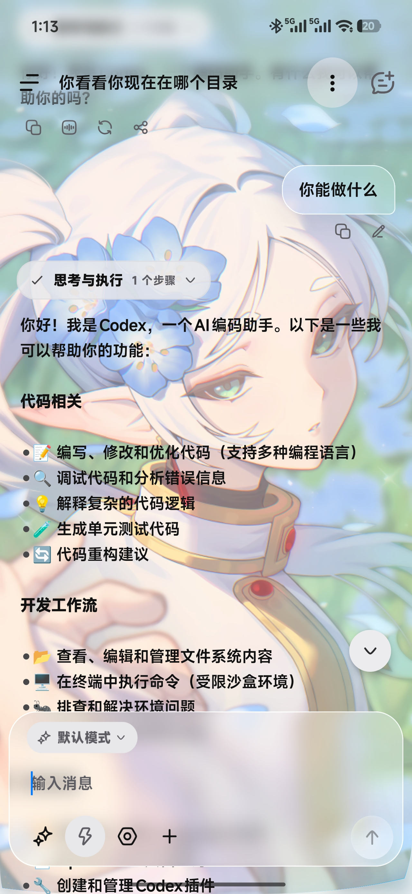
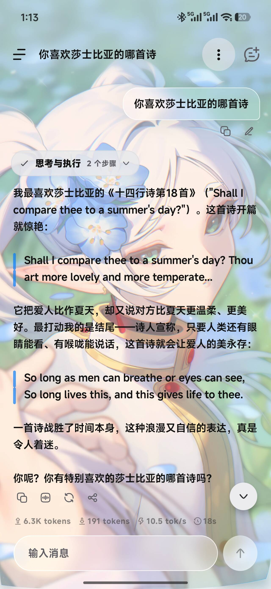
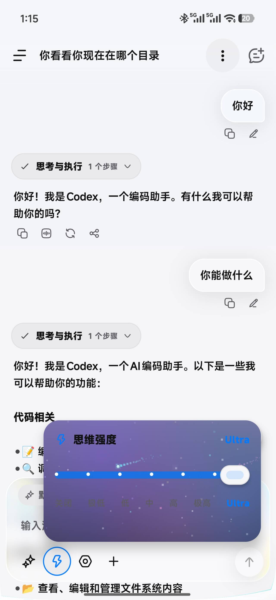
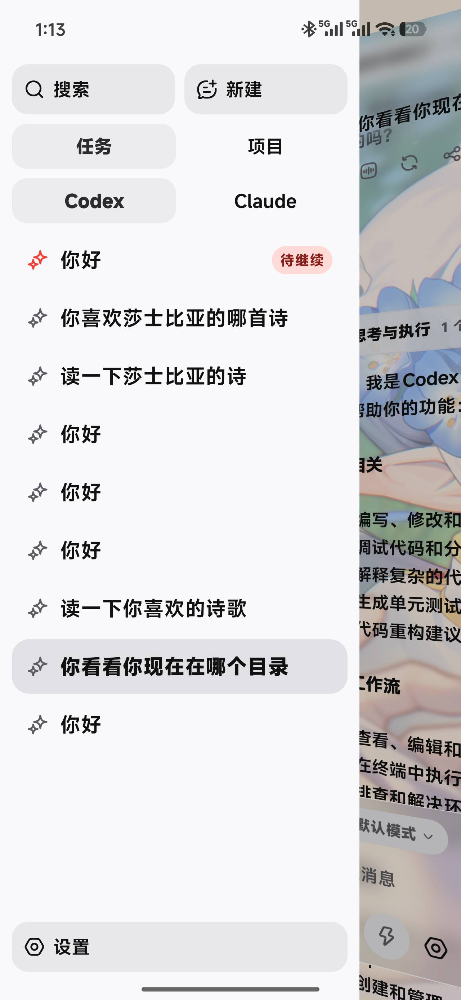
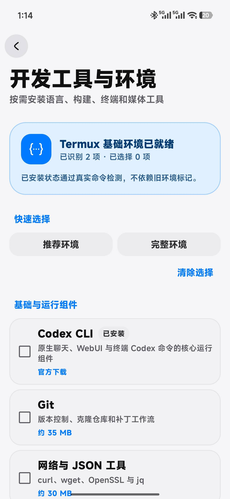
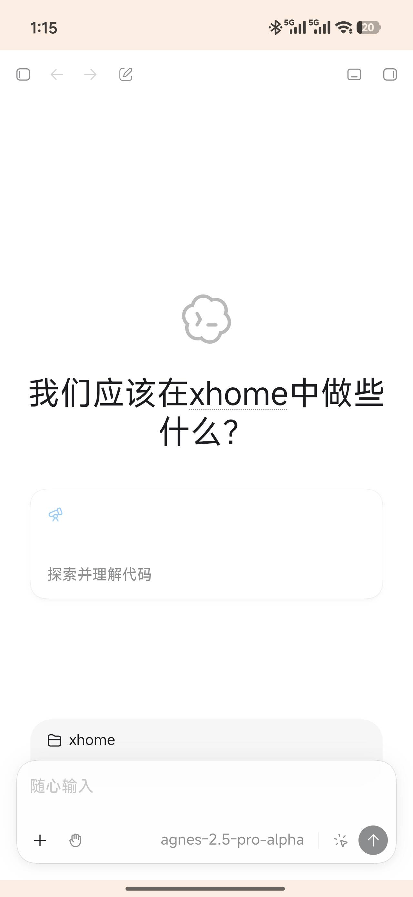
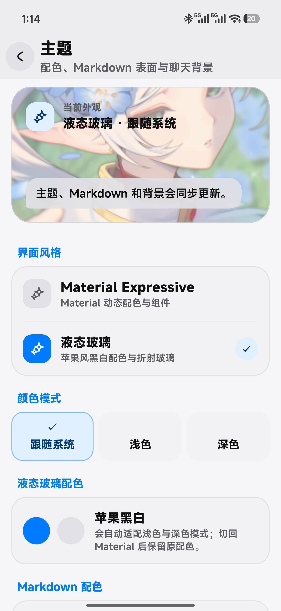
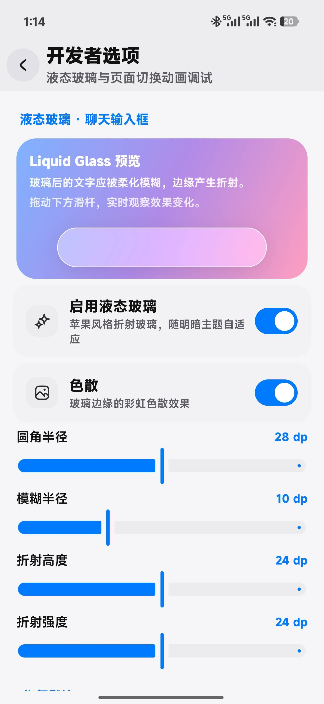
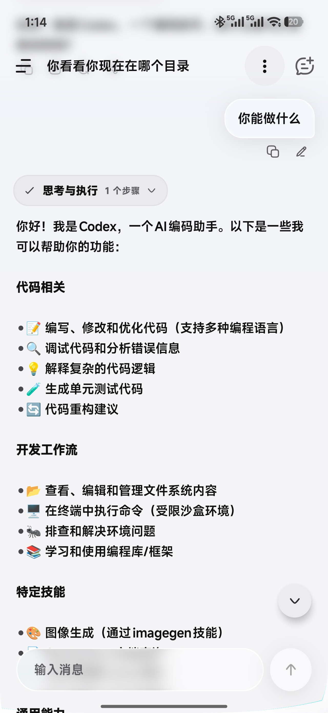
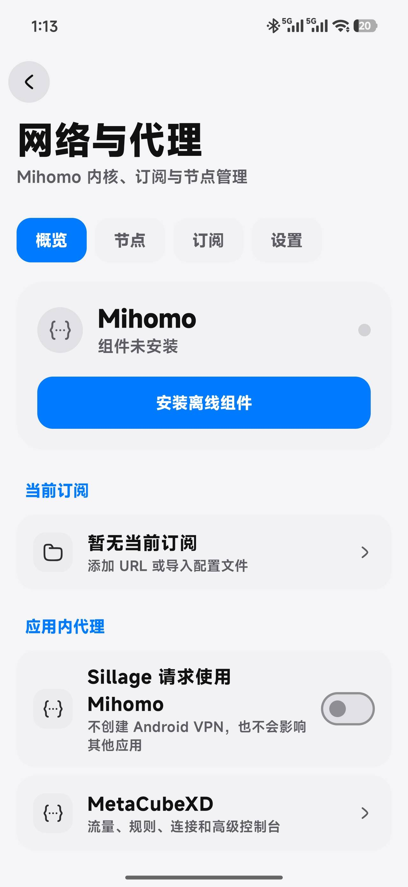

<h1 align="center">Sillage</h1>

<p align="center"><strong>Android 上的 AI 编程与移动开发工作区，以真正的 Codex CLI 为后端</strong></p>

<p align="center">在手机或平板上与 AI 协作、管理项目、运行终端并完成开发任务。</p>

<p align="center">
  
  
  <a href="./LICENSE.md"></a>
</p>

<p align="center">
  <a href="README.en.md">English</a> · 中文
</p>

<p align="center">
  <a href="../../releases/latest">下载最新版</a> ·
  <a href="./CHANGELOG.md">更新日志</a> ·
  <a href="../../issues">问题反馈</a>
</p>

## 关于 Sillage

手机上有太多"聊天式 AI"应用，但 Sillage 不是——它以真正的 **Codex CLI** 为后端，把桌面端完整的 Agent 开发体验原样搬上 Android：

- **真 Agent，不只是聊天**：AI 会制定执行计划、运行命令、修改代码，在动关键操作前征求你的批准，全程实时可见。
- **完整的开发环境**：内置 Termux 终端、Git 工作区、MCP/Skills 扩展与 Codex WebUI，一个 APK 就是一整台开发机。
- **原生体验**：所有交互都在原生 Compose 界面完成，流畅的流式输出与丰富的界面定制。

打开项目、向 AI 描述任务、实时查看执行过程、审批操作、检查代码变更，然后继续完成后续开发工作——整个流程不再依赖桌面电脑。

自带 API Key 即可使用，无需账号，开源免费。Sillage 不提供模型账号或 API 额度。

## 功能总览

| 模块 | 说明 |
|---|---|
| [原生 AI 对话](#1-原生-ai-对话) | 流式回复、Markdown 渲染、推理摘要、图片/文件附件、思考强度选择 |
| [会话管理](#2-会话管理) | 侧边栏会话列表、搜索、收藏、历史记录回溯 |
| [Agent 任务协作](#3-agent-任务协作) | 执行计划、操作审批、用户追问、子代理、任务通知 |
| [项目与 Git](#4-项目与-git) | 代码状态与 diff、暂存提交、推送分支、Worktree、快照 |
| [MCP 与 Skills](#5-mcp-与-skills) | MCP 服务管理、工具权限、Skills 安装 |
| [Termux 开发环境](#6-termux-开发环境) | 内置终端，一键安装 Codex CLI、Git、Node、Python 等工具 |
| [Codex WebUI](#7-codex-webui) | 内置桌面版 WebUI，与原生聊天共享同一会话 |
| [模型与 API 配置](#8-模型与-api-配置) | 多套 API 配置、自定义服务地址、双后端切换 |
| [个性化界面](#9-个性化界面) | 主题配色、Liquid Glass 液态玻璃、自定义聊天背景 |
| [应用内代理](#10-应用内代理) | 可选 Mihomo，订阅/节点管理，仅代理本应用 |
| [Android 系统集成](#11-android-系统集成) | 分享入口、悬浮球、后台任务、系统通知 |
| [应用更新](#12-应用更新) | GitHub Releases 检查更新，SHA-256 与签名校验 |

---

## 1. 原生 AI 对话

核心体验：以真正的 **Codex CLI** 为后端的原生聊天界面，支持流式输出、富文本 Markdown、代码高亮、表格与公式，并能在生成过程中实时渲染。所有 Agent 能力（计划、执行、审批、子代理）都由 Codex CLI 在本地驱动。

- **流式输出**：思考与回答逐段流出，实时可见。
- **富文本渲染**：标题、列表、表格、公式、代码块与语法高亮；可开启"流式渲染 Markdown"在生成过程中实时渲染。
- **推理摘要**：展示模型思考过程，可选择强度档位（含 Ultra 档，带冲击波动画与像素星空特效）。
- **附件**：发送图片与文件，让 AI 理解你的上下文。
- **模型选择**：会话中随时切换模型与思考强度。

<p align="center">
  
  
  
</p>

## 2. 会话管理

- **侧边栏会话列表**：从屏幕侧边滑出，管理所有对话。
- **新建 / 搜索 / 收藏**：快速定位历史对话，常用会话一键收藏。
- **历史回溯**：从 Codex 会话文件恢复完整历史快照，重新进入时上下文不丢。
- **工作面板**：展示当前目标、执行计划、检查点与 Git 快照状态。

<p align="center">
  
</p>

## 3. Agent 任务协作

- **执行计划**：AI 先给出分步计划，再逐步执行。
- **操作审批**：敏感操作（读写文件、执行命令）在执行前请求你的批准。
- **用户追问**：任务中途需要确认时，AI 会停下来向你提问。
- **子代理**：并行子任务以子代理卡片呈现，进度一目了然。
- **任务通知**：AI 任务在后台继续运行时，通过系统通知提醒你状态变化。
- **对话压缩**：长对话自动压缩上下文，节省 token 并保持连贯。

## 4. 项目与 Git

- **项目工作区**：选择项目目录即可开始，支持收藏与最近项目。
- **代码状态与 diff**：随时查看文件变更，AI 的每次修改都以卡片形式展示差异。
- **暂存与推送**：暂存文件、提交并推送分支，全程可在聊天中完成。
- **独立 Worktree**：在独立的 Git Worktree 中工作，不打扰主分支。
- **工作区快照**：为关键节点创建快照，随时回到安全状态。

## 5. MCP 与 Skills

- **MCP 服务管理**：添加并管理 MCP 服务器，工作面板显示每台服务器的在线状态。
- **工具权限**：按服务控制 AI 可调用的工具范围。
- **Skills 安装**：浏览并安装 Skills，让 AI 获得开箱即用的专业技能；选中的 Skills 会真正传达给模型。

## 6. Termux 开发环境

内置完整的 Termux 环境，开箱即用的移动开发底座：

- **一键安装工具**：Codex CLI、Git、Node.js、Python、Rust、Go、Java、C/C++、SSH、Tmux 等，按需安装。
- **完整终端**：类 Linux 的 Bash 环境，自由执行任何命令。
- **统一管理**：开发工具在设置页统一安装、更新与卸载。

<p align="center">
  
</p>

## 7. Codex WebUI

除了原生聊天，Sillage 还内置了 Codex 桌面版 WebUI（WebView 加载）：

- 习惯桌面布局的用户可以直接使用 WebUI 处理项目与对话。
- 原生聊天与 WebUI 共享同一个 AI 会话与子进程，切换不中断。

<p align="center">
  
</p>

## 8. 模型与 API 配置

- **多套 API 配置**：保存多组服务地址、API Key 与模型，随时切换。
- **自定义接入**：兼容 OpenAI 风格接口，自定义 Base URL。
- **推理强度**：按会话调节思考强度档位与模型能力。
- **连接测试**：配置后一键测试连通性。
- **双后端**：Codex 与 Claude 后端可切换，各自独立配置，共享同一套聊天界面。

## 9. 个性化界面

- **外观模式**：浅色、深色、跟随系统。
- **界面风格**：Material 与 Liquid Glass 液态玻璃两种风格。
- **主题配色**：丰富的配色方案，界面换肤即时生效。
- **聊天背景**：使用纯色或自定义图片作为聊天背景，也可以关闭主题获得最简洁的聊天视图。
- **液态玻璃参数**：开发者在设置中可精细调节玻璃模糊、折射等参数。
- **排版调整**：调节字号与界面透明度。

<p align="center">
  
  
  
</p>

## 10. 应用内代理

- **可选安装 Mihomo**：内置代理内核，按需启用。
- **订阅与节点管理**：导入订阅链接，管理节点与规则。
- **仅代理本应用**：只影响 Sillage 自身的请求，不影响手机上的其他应用。

<p align="center">
  
</p>

## 11. Android 系统集成

- **分享入口**：从其他应用直接分享文本、图片和文件给 AI。
- **悬浮球**：全局悬浮球快速唤出任务气泡与入口。
- **后台任务**：AI 任务在后台持续运行，配合前台服务保活，不被系统回收。
- **系统通知**：任务完成、需要审批等状态变化实时通知。
- **桌面快捷方式**：一键直达聊天、WebUI、终端与设置。

## 12. 应用更新

- **更新检查**：启动时自动检查、设置中手动检查最新版本。
- **安全校验**：APK 的 SHA-256、包名与签名证书双重校验。
- **浏览器下载**：跳转浏览器下载安装，兼容性最好。

---

## 快速开始

1. 前往 [Releases](../../releases/latest) 下载并安装最新 APK。
2. 首次启动后，在"设置 → 开发工具与环境"中安装 Codex CLI 和需要的开发工具。
3. 在"设置 → 模型与 API"中添加服务地址、API Key 和模型。
4. 新建对话，选择项目目录和模型，然后输入你的任务。

## 系统要求

- Android 7.0 或更高版本；
- 无需 Root；
- 需要用户自行准备兼容的模型 API；
- 内置 Mihomo 当前仅支持 ARM64 设备；
- Liquid Glass 折射效果需要 Android 12 或更高版本，旧系统会自动使用普通样式。

## 从源码构建

构建环境：

- JDK 17；
- Android SDK Platform 37.0；
- Android NDK `22.1.7171670`。

在项目根目录配置 `local.properties`：

```properties
sdk.dir=D\:\\path\\to\\android-sdk
```

Windows：

```powershell
.\gradlew.bat testDebugUnitTest
.\gradlew.bat assembleDebug
```

Linux / macOS：

```bash
./gradlew testDebugUnitTest
./gradlew assembleDebug
```

生成的 Debug APK 位于 `app/build/outputs/apk/debug/`。

## 参与贡献

欢迎提交 [Issue](../../issues) 或 Pull Request。反馈问题时，请提供应用版本、Android 版本、设备架构和复现步骤，并确保日志中不包含 API Key、Token、订阅地址或私人项目内容。

## 开源项目

Sillage 使用或参考了以下项目：

- [Termux](https://github.com/termux/termux-app)
- [codex-web](https://github.com/0xcaff/codex-web)
- [Mihomo](https://github.com/MetaCubeX/mihomo)
- [MetaCubeXD](https://github.com/MetaCubeX/metacubexd)
- [RikkaHub](https://github.com/rikkahub/rikkahub)

本项目不是 OpenAI、Termux、Mihomo、MetaCubeX、codex-web 或 RikkaHub 的官方产品。

## 许可证

Android 基础工程采用 [GPL-3.0-only](LICENSE.md) 许可证。第三方组件和资源遵循各自许可证，详情请查看 [THIRD_PARTY_NOTICES.md](THIRD_PARTY_NOTICES.md)。

---

<p align="center">由 <a href="https://github.com/illlyy">ILY_op</a> 维护</p>
